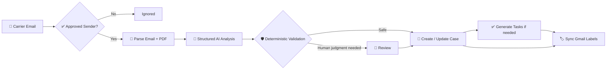
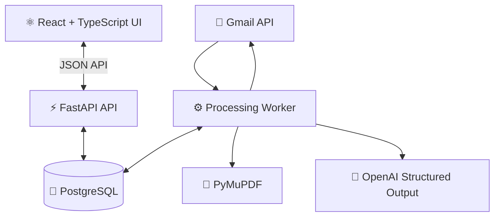
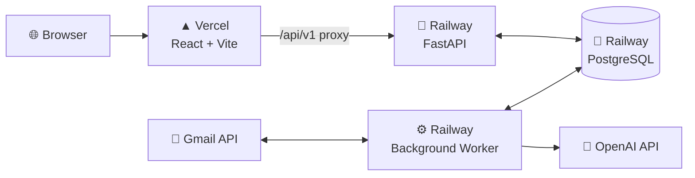

<div align="center">

# 📨 Carrier Intelligence Hub

### AI-powered carrier email operations for insurance agencies

**Turn carrier emails and PDF attachments into structured policy cases, actionable tasks, safe human reviews, and synchronized Gmail workflow labels.**

<br />

[](https://carrier-intelligence-hub.vercel.app)

<br />


</div>

---

# 🌐 Hosted Demo

**Live application:**  
https://carrier-intelligence-hub.vercel.app

Carrier Intelligence Hub is deployed using a separated frontend, API, worker, and database architecture:

- **Vercel** — React + TypeScript frontend
- **Railway** — FastAPI backend
- **Railway** — persistent background Gmail/AI processing worker
- **Railway PostgreSQL** — production application database
- **Google OAuth 2.0** — Gmail authorization
- **OpenAI API** — structured carrier-message interpretation

The frontend proxies `/api/v1` requests through the Vercel deployment to the Railway API, allowing the browser application and authentication flow to remain on a single public origin.

The background worker operates independently of the browser, so Gmail processing does not require the web application to remain open.

> The hosted environment is a demonstration deployment using synthetic insurance data. No real customer or policy data is included in the demo dataset.

---

## ✨ What is Carrier Intelligence Hub?

Insurance agents receive a constant stream of carrier emails: policy approvals, underwriting requirements, lapse warnings, commission updates, supporting PDFs, deadlines, premium changes, and other policy activity.

**Carrier Intelligence Hub turns those communications into operational work automatically.**

Instead of manually reading every message, copying policy details, creating follow-up notes, and tracking deadlines, the platform:

- connects to multiple Agent Gmail inboxes through **Google OAuth 2.0**
- accepts mail only from configured **carrier addresses and domains**
- extracts content from **email bodies and text-based PDF attachments**
- uses an LLM to classify and structure the communication
- validates AI output before it can affect operational data
- creates or updates **Cases**
- generates **Tasks** when actual work is required
- routes genuinely ambiguous situations to **Human Review**
- synchronizes workflow state back to Gmail with managed labels
- gives Managers an agency-wide operational view

> **The AI proposes. The backend validates. Humans decide only when necessary.**

---

## 🚀 From inbox to action



### Example

In this representative synthetic example, a carrier sends:

> **Policy Issued — Mary Smith**  
> Policy `ATN-554433221` was approved and issued.  
> Effective date: `09/01/2026`  
> Monthly premium: `$145.00`  
> Policy packet mailed to the client.

Carrier Intelligence Hub can turn that into:

**Case**
- Mary Smith
- Aetna
- ATN-554433221
- Policy Issued
- Premium: $145.00

**Tasks**
- Notify the client that the policy was approved and mailed
- Verify the first premium draft on 09/01/2026

**Gmail**
- `AI: Policy Issued`
- `AI: Action Required`

---

# 🧠 AI that is useful — without blindly trusting AI

The model does **semantic interpretation**, but it does not control the database.

The processing layer uses:

- strict structured output
- grounded evidence
- deterministic field validation
- case-identity checks
- action-item validation
- source conflict detection
- idempotent materialization
- bounded retry handling

The model has **no tools**, no database access, and cannot choose the authoritative carrier.

### Automatic vs Review vs Task

| Outcome | When it happens | Example |
|---|---|---|
| ✅ **Automatic** | The communication is clear and safely grounded | A policy is issued with matching client, policy, premium, and date |
| 👤 **Review** | A human can resolve a conflict using evidence already inside Carrier Hub | Email says **Emily Robertson**, attached official PDF says **Emily Robinson** |
| 📌 **Task** | The answer requires real-world follow-up | One communication contains unresolved premium figures that must be verified with the carrier |

This keeps **Review exceptional**, rather than using it as a generic fallback whenever the model is uncertain.

---

# 📁 Cases are the operational record

A **Case** represents the policy communication and its structured history.

A Case can exist even when there are **zero Tasks**.

For example, a carrier may send a Commission Update that contains useful policy information but explicitly says:

> No action is required.

Carrier Intelligence Hub still preserves that communication as a Case. The Agent can review it, add a manual Task if needed, or mark the Case complete.

### Case lifecycle

**Active → Completed**

Cases may also be **Dismissed** and restored later.

A Case can contain:

- structured policy information
- AI summary and classification
- premium and status
- communication history
- extracted email content
- PDF evidence
- system-generated Tasks
- manually created Tasks
- audit activity
- Review history

---

# ✅ Task management

Tasks are generated only when the communication contains or implies real operational work.

Examples:

- obtain a signed HIPAA authorization
- clarify prescription history
- submit underwriting documents before a deadline
- contact a client about an NSF payment
- update banking information before a lapse date
- notify a client that a policy was issued
- verify the first premium draft

Task states support:

**Open · In Progress · Completed · Dismissed**

Deadlines are preserved where the source provides them, including relative deadlines such as business-day requirements.

---

# 👤 Human Review

Review exists for situations where automation should **not guess**.

A reviewer sees:

- the detected issue
- competing grounded values
- source labels
- source excerpts
- AI analysis
- editable final fields
- action items
- attachments and communication context

### Example: email vs PDF conflict

| Source | Client Name |
|---|---|
| 📨 Email body | Emily **Robertson** |
| 📄 Policy confirmation PDF | Emily **Robinson** |

All other policy information matches.

Instead of silently picking one value, the system creates a Review. The Agent chooses the correct value and applies it through the same safe materialization path used by automatic processing.

---

# 🏷️ Gmail workflow synchronization

Carrier Intelligence Hub projects operational state back to Gmail using managed labels.

### Workflow labels

- `AI: Processing`
- `AI: Needs Review`
- `AI: Action Required`
- `AI: No Further Action Needed`
- `AI: Failed`

### Classification labels

- `AI: Policy Issued`
- `AI: Pending Requirements`
- `AI: Lapse Notice`
- `AI: Commission Update`

Only Carrier Intelligence Hub's own managed labels are modified. Existing user labels and Gmail system state are left alone.

---

# 👥 Agent and Manager roles

### 🧑‍💼 Agent

Agents handle day-to-day operational work:

- connect and manage their Gmail inbox
- work assigned Cases
- update Task statuses
- create manual Tasks
- resolve Reviews
- correct Case information
- complete or dismiss Cases
- view their operational activity

### 📊 Manager

Managers supervise the agency:

- view agency-wide Cases and workload
- monitor Gmail connection health
- inspect analytics and activity
- manage carrier configuration
- assign and reassign Cases
- review audit history

Task updates, Review decisions, Case corrections, and Case completion remain with the assigned Agent. Managers retain agency-wide visibility, Case reassignment, and Case dismissal/restoration controls.

---

# 🛡️ Reliability and safety

The project is designed around the idea that email processing should be **recoverable and idempotent**.

### Key safeguards

- stable Gmail mailbox identity
- durable observed-message ledger
- duplicate-message prevention using stable logical-mailbox identity plus immutable Gmail message IDs
- encrypted OAuth tokens at rest
- sender whitelist before body processing
- external calls outside long-running database transactions
- reusable saved AI analysis after materialization failure
- idempotent Task generation
- one Review lifecycle per source message
- stale-processing recovery
- Gmail label outbox/reconciliation
- server-side RBAC
- CSRF protection
- HttpOnly application sessions
- Argon2id password hashing

A valid AI analysis can be saved before materialization, allowing a later retry to reuse the existing result instead of unnecessarily calling the model again.

---

# 🏗️ Architecture



The browser application and background processing pipeline remain separate so Gmail or AI processing failures do not take down the web application.

---

# ☁️ Deployment architecture



### Production responsibilities

**Vercel**
- serves the React/Vite application
- handles SPA route fallback
- proxies `/api/v1/*` to the Railway backend
- keeps browser API traffic on the application's public origin

**Railway API**
- runs the FastAPI application
- handles authentication and authorization
- exposes the application API
- performs business-rule validation
- reads and writes operational data

**Railway Worker**
- runs independently from the web server
- polls connected Gmail inboxes
- parses approved carrier communication
- invokes AI analysis
- materializes validated Cases, Tasks, and Reviews
- reconciles Gmail workflow labels

**Railway PostgreSQL**
- acts as the durable system of record
- stores users, Cases, Tasks, messages, Reviews, Gmail connections, evidence, sessions, and audit events

This separation means closing the browser does not interrupt Gmail processing.

---

# 🧰 Tech stack

### Frontend

- **React 19**
- **TypeScript**
- **Vite**
- **React Router**
- **TanStack Query**
- **Tailwind CSS**
- **Recharts**
- **Vitest + Testing Library**

### Backend

- **Python 3.14**
- **FastAPI**
- **Pydantic**
- **SQLAlchemy 2**
- **Alembic**
- **psycopg**
- **PyMuPDF**
- **OpenAI Responses API**

### Infrastructure & integrations

- **PostgreSQL 17**
- **Gmail API**
- **Google OAuth 2.0**
- **OpenAI API**
- **Vercel**
- **Railway**
- persistent background Python worker
- encrypted OAuth credential storage

---

# 🖥️ Product areas

The application includes:

| Area | Purpose |
|---|---|
| 🏠 **Dashboard** | Current workload, priorities, Reviews, and operational overview |
| 📁 **Cases** | Active, Completed, and Dismissed policy cases |
| ✅ **Tasks** | Agent work queue with status, priority, and due dates |
| 👤 **Reviews** | Human decisions for grounded ambiguities |
| 📨 **Gmail Connections** | Mailbox authorization, sync state, and recent carrier communications |
| 📊 **Analytics** | Manager-level operational visibility |
| 👥 **Agents** | Agency workforce and assignment visibility |
| ⚙️ **Carrier Configuration** | Approved carrier domains and sender addresses |
| 🧾 **Activity / Audit** | Durable operational history |

---

# 🎬 Representative demo scenarios

The synthetic demo dataset exercises both the assignment requirements and representative operational edge cases. It contains no real customer data.

### Policy Issued

A carrier confirms a policy has been approved and mailed.

**Result:** Case + post-issue follow-up Tasks.

### Pending Requirements

Underwriting requests multiple documents with a submission deadline.

**Result:** Case + separate grounded Tasks + due date.

### Lapse Notice

A premium payment is returned NSF and the policy enters its grace period.

**Result:** Urgent Case + client-contact/remediation Tasks.

### Commission Update

The carrier reports a successful commission posting and states that no action is required.

**Result:** Case with **0 Tasks**, preserving the communication without inventing work.

### Source conflict requiring Review

Email and attached PDF disagree on the client's surname while all policy identity fields match.

**Result:** Human Review instead of an unsafe automatic guess.

---

# 🎥 Suggested demo flow

The hosted application can be demonstrated from both Manager and Agent perspectives.

A representative walkthrough is:

1. **Dashboard** — show workload, priority, task, and Review visibility.
2. **Cases** — open a carrier Case and inspect its structured policy information and communication history.
3. **Tasks** — show how actionable carrier requests become assigned operational work.
4. **Reviews** — demonstrate how source conflicts are routed to a human rather than guessed.
5. **Gmail Connections** — show OAuth-connected inboxes and processing status.
6. **Carrier Configuration** — show the carrier sender/domain whitelist.
7. **Activity / Audit** — demonstrate the durable record of system and user actions.
8. **Manager view** — show agency-wide visibility, analytics, assignments, and configuration controls.
9. **Agent view** — show the narrower operational workflow available to an assigned Agent.
10. **Live processing** — send or surface an approved carrier-style email and allow the worker to process it into structured operational data.

The key architectural principle during the demonstration is:

> **The LLM proposes; the backend decides whether that proposal is safe to materialize.**

---

# 🔐 Gmail and AI privacy boundaries

Carrier Intelligence Hub never asks for or stores a Gmail password.

Google OAuth credentials are encrypted before persistence.

For approved carrier communications, the AI receives only the source material necessary for analysis, such as:

- authoritative carrier name
- subject
- received timestamp
- cleaned email text
- extracted PDF text

It does **not** receive:

- Gmail passwords
- OAuth secrets
- application passwords
- browser session tokens
- encryption keys
- unrelated mailbox content
- raw PDF bytes

OpenAI calls use structured output with `tools=[]` and `store=False`.

---

# ⚙️ Local development

## Prerequisites

- Python 3.14+
- Node.js
- PostgreSQL 17
- Google OAuth credentials only when testing live Gmail
- OpenAI API key only when testing live AI processing

## 1. Database + backend

```powershell
cd backend

pwsh -ExecutionPolicy Bypass -File .\scripts\setup_postgres.ps1

python -m venv .venv
& .\.venv\Scripts\python.exe -m pip install -e ".[dev]"

& .\.venv\Scripts\python.exe -m alembic upgrade head
& .\.venv\Scripts\python.exe -m app.db.seed
```

The setup script securely prompts for PostgreSQL administrator and synthetic demo-login passwords. It creates the dedicated local application role plus development and test databases, then writes the ignored `backend/.env`.

The seed command is explicit and idempotent. It creates synthetic local Agent/Manager accounts and representative operational data but no Gmail connection or OAuth credential.

## 2. Frontend

```powershell
cd ..\frontend
npm install
```

## 3. Start the application

```powershell
cd ..
pwsh -ExecutionPolicy Bypass -File .\scripts\start-dev.ps1
```

Then open:

**Frontend:** `http://localhost:5173`  
**API:** `http://localhost:8000`  
**OpenAPI:** `http://localhost:8000/docs`

---

# 🔑 Gmail development configuration

For live Gmail testing, enable the Gmail API, configure a Google OAuth **Web application** client, and add the intended account as a test user while the consent screen remains in testing mode.

Carrier Hub requests `gmail.modify` so it can read approved messages and maintain its own workflow labels; it does not send, draft, delete, trash, archive, or change read state.

Register this OAuth callback in Google Cloud:

```text
http://localhost:8000/api/v1/gmail/oauth/callback
```

Example environment configuration:

```dotenv
GOOGLE_OAUTH_CLIENT_ID=
GOOGLE_OAUTH_CLIENT_SECRET=
GOOGLE_TOKEN_ENCRYPTION_KEY=
GOOGLE_OAUTH_REDIRECT_URI=http://localhost:8000/api/v1/gmail/oauth/callback

GMAIL_POLL_INTERVAL_SECONDS=60
GMAIL_INITIAL_LOOKBACK_DAYS=7

OPENAI_API_KEY=
OPENAI_MODEL=gpt-5.6-terra

AI_AUTO_APPLY_CONFIDENCE_THRESHOLD=0.80
MESSAGE_PROCESS_MAX_AUTO_ATTEMPTS=3
```

Secrets belong only in the ignored `backend/.env`.

`GOOGLE_TOKEN_ENCRYPTION_KEY` must be a dedicated Fernet key.

The complete configuration surface, including database URLs, worker cadence, bounded retries, PDF limits, and frontend origin, is documented with safe placeholders in `backend/.env.example`.

The API application can start without Gmail or OpenAI credentials; those integrations report safe unconfigured states until enabled. The standalone processing worker requires both integrations to be configured before entering its continuous processing loop.

---

# 🚀 Hosted configuration

The hosted application uses:

```text
Frontend
https://carrier-intelligence-hub.vercel.app
```

Production API requests are made through:

```text
https://carrier-intelligence-hub.vercel.app/api/v1/*
```

and proxied to the Railway-hosted FastAPI service.

The Google OAuth production callback is:

```text
https://carrier-intelligence-hub.vercel.app/api/v1/gmail/oauth/callback
```

Secrets are stored as deployment environment variables and are not committed to the repository.

The FastAPI service and background worker use the same production PostgreSQL database and the same Gmail credential-encryption key.

---

# 🧪 Verification

### Backend

```powershell
cd backend
& .\.venv\Scripts\python.exe -m ruff check .
& .\.venv\Scripts\python.exe -m ruff format --check .
& .\.venv\Scripts\python.exe -m pytest
& .\.venv\Scripts\python.exe -m alembic current
```

Backend integration tests refuse to run unless `TEST_DATABASE_URL` names the dedicated `carrier_intelligence_hub_test` PostgreSQL database. Test data is transaction-isolated.

### Frontend

```powershell
cd ..\frontend
npm run lint
npm run format:check
npm run test -- --run
npm run build
```

### Hosted smoke test

The deployed environment has been verified for:

- Vercel SPA routing
- Vercel → Railway API proxy
- FastAPI health endpoint
- PostgreSQL connectivity
- schema migrations
- application login
- session authentication
- Dashboard
- Cases
- Tasks
- Reviews
- Gmail credential decryption
- continuous worker operation
- Gmail polling cycles

Health endpoint:

```text
https://carrier-intelligence-hub.vercel.app/api/v1/health
```

Expected response:

```json
{
  "status": "ok",
  "service": "carrier-intelligence-api"
}
```

---

# 📌 Current scope

### ✅ Implemented

- Gmail OAuth 2.0
- multiple Agent inboxes
- carrier sender/domain whitelist
- unread-message polling
- MIME email parsing
- text-based PDF extraction
- structured LLM classification and extraction
- grounded action-item generation
- deterministic validation
- Cases
- Tasks
- Human Review
- Agent / Manager RBAC
- Case completion and dismissal
- manual Tasks
- durable audit history
- processing retries
- stale-work recovery
- deduplication
- managed Gmail workflow labels
- responsive operations UI
- persistent PostgreSQL data model
- separate API and background worker services
- secure production session configuration
- hosted Vercel frontend
- hosted Railway FastAPI backend
- hosted Railway background worker
- hosted Railway PostgreSQL database
- production Gmail OAuth callback configuration
- same-origin frontend API proxy
- SPA deep-link routing

### 🔭 Future improvements

- OCR for image-only/scanned PDFs
- Gmail push notifications instead of polling
- optional CRM delivery
- email-based Agent invitations
- Google OAuth production verification
- automated production backups
- expanded monitoring and observability
- CI/CD deployment gates
- additional production security/compliance hardening

### ⚠️ Prototype boundaries

Gmail discovery currently uses polling rather than push notifications.

Text-based PDFs are supported; scanned/image-only documents require future OCR.

The sender whitelist is an operational filter, not cryptographic SPF/DKIM/DMARC proof.

Confidence is a routing signal rather than a calibrated probability.

A hosted demonstration environment exists, but the project remains a **production-minded prototype**. It is not represented as Google production-verified, HIPAA-compliant, SOC 2 certified, or ready for handling real regulated customer data without additional security, compliance, operational, and legal review.

---

# 📚 Additional documentation

Detailed technical notes live in:

- `docs/architecture.md`
- `docs/ai-processing.md`
- `docs/gmail-integration.md`
- `docs/pipeline-reliability.md`
- `docs/authentication.md`
- `docs/data-model.md`

---

<div align="center">

## Built as a production-minded insurance operations prototype

**Carrier Intelligence Hub combines AI interpretation with deterministic software controls so routine carrier communication becomes structured work — while ambiguous decisions stay with the human Agent.**

<br />

### [🌐 Open the hosted demo](https://carrier-intelligence-hub.vercel.app)

</div>
