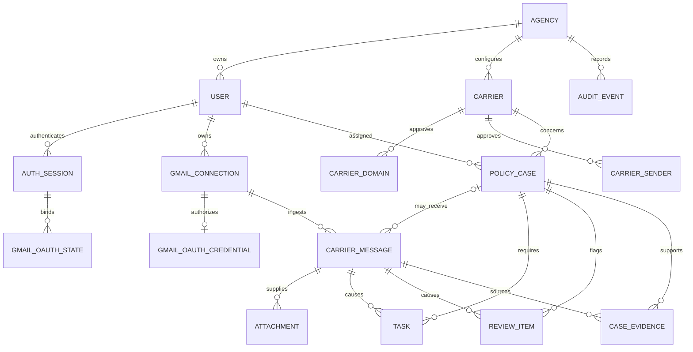

# Data Model

The schema keeps identity, incoming communications, operational work, and audit history separate while giving every business record an agency ownership boundary.

| Table | Purpose |
| --- | --- |
| `agencies` | Organization boundary, display name, timezone, and active state. |
| `users` | Internal Agent/Manager identity, normalized unique email, Argon2id password hash, and active state. |
| `auth_sessions` | Server-side sessions containing only token/CSRF hashes, expiry, last-seen, and revocation state. |
| `gmail_connections` | Non-secret mailbox identity, owner, health, and sync timestamps. |
| `gmail_oauth_credentials` | One encrypted token set and granted-scope record per Gmail connection. |
| `gmail_oauth_states` | Short-lived hashed, session-bound, one-time OAuth callback state. |
| `carriers` | Agency-approved insurance carrier configuration. |
| `carrier_domains` | Normalized approved sender domains for a carrier. |
| `carrier_senders` | Normalized exact approved sender addresses for a carrier. |
| `cases` | Current, long-lived policy workflow state for one client/policy. |
| `carrier_messages` | Individual incoming communications and their classification/processing state. |
| `attachments` | Gmail attachment metadata in `PENDING` state; no attachment bytes are fetched yet. |
| `tasks` | Assigned actions caused by a communication, including due date, priority, and completion. |
| `review_items` | Human-review queue entries explaining what needs attention and how it was resolved. |
| `case_evidence` | Short source excerpts supporting extracted case fields; never hidden reasoning. |
| `audit_events` | Append-oriented operational/security history with safe JSON metadata. |

`cases` and `carrier_messages` are intentionally separate. A case represents the latest known state of an ongoing policy; several emails can update it over time. Keeping each communication preserves its sender, source text, received time, attachments, and processing status. Tasks, evidence, reviews, and audit events can then trace back to the exact communication that caused them without overwriting case history.

A carrier message is persisted before semantic analysis begins. Its `processing_status` records the ingestion/analysis lifecycle (`RECEIVED`, `PROCESSING`, `PROCESSED`, `NEEDS_REVIEW`, `FAILED`, or `IGNORED`), while `classification`, `summary`, and `priority` are semantic results that may initially be null. The database does not invent placeholder AI results: a conditional constraint instead requires all three semantic fields only when a message is marked `PROCESSED`. Other lifecycle states can truthfully represent incomplete or failed analysis.

Important database rules include globally unique user emails for unambiguous login; unique carrier names, approved domains, and exact senders within an agency; a partial unique case identity on agency/carrier/policy number when a policy number exists; one OAuth credential row per Gmail connection; unique `(gmail_connection_id, gmail_message_id)` pairs for Gmail idempotency; unique `(carrier_message_id, external_id)` attachment metadata; and complete semantic fields for every `PROCESSED` carrier message. Focused indexes support agency/role lookups, session lookup/expiration, expiring OAuth state, assigned task status/due dates, case priority/status, message processing state, open reviews, and chronological/type-filtered audit logs.

Credential columns contain Fernet ciphertext, not plaintext Google tokens. The encryption key is deliberately outside PostgreSQL and Git. OAuth state stores a SHA-256 lookup hash rather than the browser value, expires after ten minutes, is bound to the initiating agency/user/session, and records consumption so callbacks cannot be replayed.
