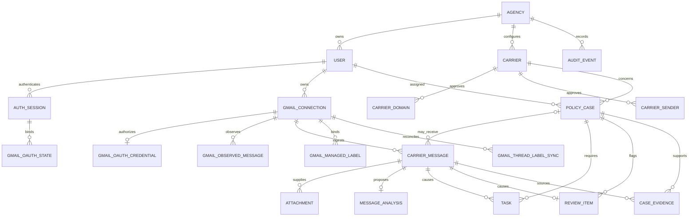

# Data Model

The schema keeps identity, incoming communications, operational work, and audit history separate while giving every business record an agency ownership boundary.

| Table | Purpose |
| --- | --- |
| `agencies` | Organization boundary, display name, timezone, and active state. |
| `users` | Internal Agent/Manager identity, normalized unique email, Argon2id password hash, and active state. |
| `auth_sessions` | Server-side sessions containing only token/CSRF hashes, expiry, last-seen, and revocation state. |
| `gmail_connections` | Non-secret mailbox identity, owner, health, and sync timestamps. |
| `gmail_oauth_credentials` | One encrypted token set and granted-scope record per Gmail connection. |
| `gmail_oauth_states` | Short-lived hashed, session-bound, one-time OAuth callback state. |
| `gmail_observed_messages` | Durable identity ledger keyed by logical Gmail connection and immutable Gmail message ID; survives operational message deletion/reset. |
| `gmail_managed_labels` | Mailbox-specific bindings from the nine current logical app labels to Gmail user-label IDs; a retired `Processed` binding may exist only for legacy cleanup. |
| `gmail_thread_label_syncs` | One reconciliation/outbox row per Gmail connection and thread, with generation, claim, retry, and applied-state metadata. |
| `carriers` | Agency-approved insurance carrier configuration. |
| `carrier_domains` | Normalized approved sender domains for a carrier. |
| `carrier_senders` | Normalized exact approved sender addresses for a carrier. |
| `cases` | Current, long-lived policy workflow state for one client/policy. |
| `carrier_messages` | Individual incoming communications and their classification/processing state. |
| `attachments` | Gmail metadata plus extraction state, page count, safe error code, and extracted text; original bytes are never stored. |
| `message_analyses` | One versioned model proposal per message, deterministic flags, and a separate optional human-finalized result. |
| `tasks` | Assigned actions with due date, priority, status, creator/completer attribution, and optional source-message/action identity; manual Tasks need no source message. |
| `review_items` | At most one human-review lifecycle row per CarrierMessage, reused for dismiss/return/apply decisions. |
| `case_evidence` | Short source excerpts supporting extracted case fields; never hidden reasoning. |
| `audit_events` | Append-oriented operational/security history with safe JSON metadata. |

`cases` and `carrier_messages` are intentionally separate. A case represents the latest known state of an ongoing policy; several emails can update it over time. Keeping each communication preserves its sender, source text, received time, attachments, and processing status. Tasks, evidence, reviews, and audit events can then trace back to the exact communication that caused them without overwriting case history.

A carrier message is persisted before semantic analysis begins. Its `processing_status` records the ingestion/analysis lifecycle (`RECEIVED`, `PROCESSING`, `PROCESSED`, `NEEDS_REVIEW`, `FAILED`, or `IGNORED`), while `classification`, `summary`, and `priority` are semantic results that may initially be null. `processing_next_retry_at` makes automatic retry eligibility explicit. The initial processing attempt counts toward the configured maximum; exhausted and permanent failures have no next retry time. The database does not invent placeholder AI results: a conditional constraint instead requires all three semantic fields only when a message is marked `PROCESSED`.

Important database rules include globally unique user emails; unique carrier configuration; a partial unique case identity on agency/carrier/policy number; one OAuth credential per connection; unique CarrierMessage and observed-ledger identities per logical Gmail connection/message; unique attachment identities; one analysis and at most one Review per message; one source-linked Task per `(source message, action index)`; and complete semantic fields for every `PROCESSED` message. Manual Tasks may have no source message. Model proposals remain preserved when a human supplies corrected final values, retaining accountability without hidden reasoning.

A supported communication may create or update a Case with zero Tasks when `action_items` is empty. No placeholder Task is invented, and a zero-task Case may be completed when it has no active Review. Whole-Case reassignment moves active Tasks and active Reviews while preserving historical Task creator/completer and terminal Review attribution.

Label state contains no message body, PDF text, AI output, client name, or policy number. A unique `(gmail_connection_id, gmail_thread_id)` row represents delivery state, while `generation` prevents a provider response for an old desired state from marking newer work applied. The migration backfills one pending row for each existing real Gmail-backed thread without calling Google or fabricating label IDs.

Credential columns contain Fernet ciphertext, not plaintext Google tokens. The encryption key is deliberately outside PostgreSQL and Git. OAuth state stores a SHA-256 lookup hash rather than the browser value, expires after ten minutes, is bound to the initiating agency/user/session, and records consumption so callbacks cannot be replayed.
