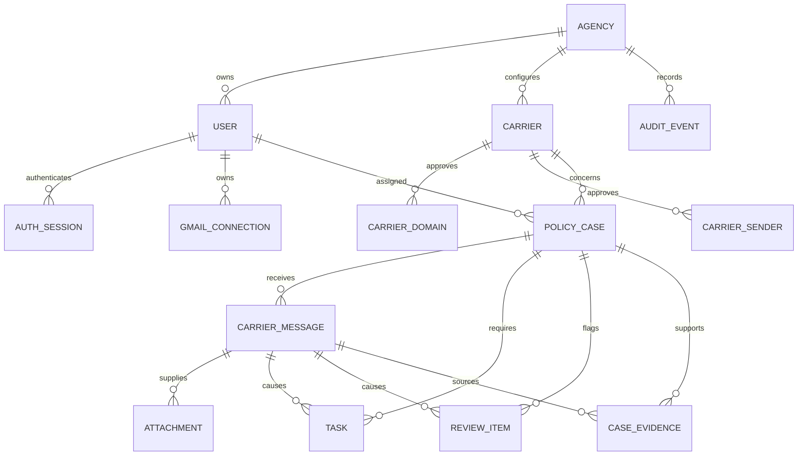

# Data Model

The schema keeps identity, incoming communications, operational work, and audit history separate while giving every business record an agency ownership boundary.

| Table | Purpose |
| --- | --- |
| `agencies` | Organization boundary, display name, timezone, and active state. |
| `users` | Internal Agent/Manager identity, normalized unique email, Argon2id password hash, and active state. |
| `auth_sessions` | Server-side sessions containing only token/CSRF hashes, expiry, last-seen, and revocation state. |
| `gmail_connections` | Non-secret future mailbox ownership and health metadata; no OAuth tokens. |
| `carriers` | Agency-approved insurance carrier configuration. |
| `carrier_domains` | Normalized approved sender domains for a carrier. |
| `carrier_senders` | Normalized exact approved sender addresses for a carrier. |
| `cases` | Current, long-lived policy workflow state for one client/policy. |
| `carrier_messages` | Individual incoming communications and their classification/processing state. |
| `attachments` | Message attachment metadata and optional extracted text; no files are fetched yet. |
| `tasks` | Assigned actions caused by a communication, including due date, priority, and completion. |
| `review_items` | Human-review queue entries explaining what needs attention and how it was resolved. |
| `case_evidence` | Short source excerpts supporting extracted case fields; never hidden reasoning. |
| `audit_events` | Append-oriented operational/security history with safe JSON metadata. |

`cases` and `carrier_messages` are intentionally separate. A case represents the latest known state of an ongoing policy; several emails can update it over time. Keeping each communication preserves its sender, source text, received time, classification, attachments, and processing status. Tasks, evidence, reviews, and audit events can then trace back to the exact communication that caused them without overwriting case history.

Important database rules include globally unique user emails for unambiguous login; unique carrier names, approved domains, and exact senders within an agency; a partial unique case identity on agency/carrier/policy number when a policy number exists; and unique `(gmail_connection_id, gmail_message_id)` pairs for future Gmail idempotency. Focused indexes support agency/role lookups, session lookup/expiration, assigned task status/due dates, case priority/status, message processing state, open reviews, and chronological/type-filtered audit logs.
